### Check for NULLs or Duplicates in Primary Key

---

### SQL Query to Find Duplicate or Null `cst_id` with Their Counts

When working with customer data, it's often essential to spot potential data quality issues, such as duplicates or null values. In this post, I'll walk you through an SQL query that helps identify such issues in the `cst_id` field from the `bronze.crm_cust_info` table.

Let's dive into the query:

```sql
SELECT
     cst_id,
     COUNT(*) AS no_of_counts
FROM bronze.crm_cust_info
GROUP BY cst_id
HAVING COUNT(*) > 1 OR cst_id IS NULL;

```

### 1. **`SELECT` Clause**:

The first part of the query is the `SELECT` clause, which is where we define what data we want to retrieve from the database. In this case, we want to retrieve the `cst_id` and the count of how many times each `cst_id` appears in the table. The `COUNT(*)` function will count all the rows for each `cst_id`.

```sql
SELECT
     cst_id,
     COUNT(*) AS no_of_counts

```

- **`cst_id`**: This represents the unique customer identifier in the table.
- **`COUNT(*) AS no_of_counts`**: This counts how many times each `cst_id` appears. We alias this count as `no_of_counts` for better readability.

### 2. **`FROM` Clause**:

The `FROM` clause tells the database which table to pull the data from. In this case, we're working with the `bronze.crm_cust_info` table, which presumably contains customer information.

```sql
FROM bronze.crm_cust_info

```

### 3. **`GROUP BY` Clause**:

Now, we're interested in counting the occurrences of each `cst_id`. To do this, we group the data by `cst_id`. This means that for each unique `cst_id`, we'll aggregate the rows together and count how many times that `cst_id` appears.

```sql
GROUP BY cst_id

```

### 4. **`HAVING` Clause**:

The `HAVING` clause comes into play after the grouping, and it allows us to filter out results based on the aggregate values.

In this case, we're interested in `cst_id`s that either:

- Appear more than once (`COUNT(*) > 1`), which indicates a duplicate.
- Or, the `cst_id` is `NULL`, which is another common issue in databases that we might want to address.

```sql
HAVING COUNT(*) > 1 OR cst_id IS NULL;

```

### 5. **The Result:**

Once the query is run, the result looks something like this:

| **cst_id** | **no_of_counts** |
| --- | --- |
| 29449 | 2 |
| 29473 | 2 |
| 29433 | 2 |
| NULL | 3 |
| 29483 | 2 |
| 29466 | 3 |

From the output, we can easily spot:

- Duplicate `cst_id`s, such as `29449`, `29473`, and `29433`, which each appear twice.
- Null values in the `cst_id` column, which might indicate incomplete data (3 occurrences in this case).

### 6. **Why Is This Useful?**

This query is really helpful in data cleaning and validation. You can use it to identify:

- Duplicate entries that might lead to skewed analysis or incorrect reporting.
- `NULL` values that could represent missing or unprocessed data.

In a real-world scenario, once you find these duplicates or nulls, you can either:

- Investigate why these entries are duplicated and fix the underlying issue.
- Decide whether to handle null values by filling them with a placeholder value or removing those rows from your dataset.

---

### Investigating a Duplicate `cst_id` to Explore the Data Further

After identifying that `cst_id = 29466` is a duplicate, let’s now dive deeper into the data associated with this particular `cst_id`. In the previous step, we ran a query to identify duplicate entries, but now we want to understand the actual data for this customer. Here's the query we'll use to explore all records for `cst_id = 29466`:

```sql
sql
Copy
SELECT
    *
FROM bronze.crm_cust_info
WHERE cst_id = 29466;

```

### Explanation:

- **`SELECT *`**: This will select all columns from the table for each row associated with `cst_id = 29466`.
- **`WHERE cst_id = 29466`**: This filters the data to include only rows where `cst_id` matches `29466`.

### Result:

When we run the above query, the output is as follows:

| cst_id | cst_key | cst_firstname | cst_lastname | cst_martial_status | cst_gndr | cst_create_date |
| --- | --- | --- | --- | --- | --- | --- |
| 29466 | AW00029466 | NULL | NULL | NULL | NULL | 2026-01-25 |
| 29466 | AW00029466 | Lance | Jimenez | M | NULL | 2026-01-26 |
| 29466 | AW00029466 | Lance | Jimenez | M | M | 2026-01-27 |

### Analysis:

Now that we have the records for `cst_id = 29466`, let’s break down what we’re seeing:

1. **First Row**:
    - The first record for `cst_id = 29466` shows a row with missing first name, last name, marital status, gender, and create date. This could indicate that the entry was initially created with minimal information.
2. **Second Row**:
    - The second record provides more complete information: `Lance Jimenez` is the first and last name, and the marital status is marked as `M` (presumably for "Married"). However, the gender column is still `NULL`, which may be an issue in terms of data consistency.
3. **Third Row**:
    - The third row for the same `cst_id` contains the same name but this time includes a gender value (`M` for male), indicating that some data has been updated or filled in over time.

### Understanding the Possible Causes of Duplicates

From the data, it appears that `cst_id = 29466` has multiple records with different levels of information, suggesting that this might be due to the following reasons:

1. **Incomplete Data Entry**:
    
    The first record could have been created as an incomplete entry, with only the `cst_key` populated, leaving other fields such as name and gender as `NULL`. The subsequent records show the `cst_id` being updated with the missing data over time.
    
2. **Multiple Entries for Updates**:
    
    It’s also possible that the system was set up to allow multiple records for the same `cst_id` as new information was provided. This might indicate that the data entry process needs to be revisited to ensure that we don’t create multiple records for the same person unnecessarily.
    
3. **Data Correction**:
    
    Another possible cause is data corrections. If the customer’s information was initially incomplete or incorrect, a new entry may have been created, which is why we see a gradual filling of missing fields.
    

### Keeping the Latest Record Using `ROW_NUMBER()` Window Function

Now that we’ve identified duplicate entries, let’s use the `ROW_NUMBER()` window function to easily isolate and keep the latest record for each `cst_id`.

The `ROW_NUMBER()` function assigns a unique number to each row within a partition of data. In our case, we partition by `cst_id` and order by `cst_create_date` in descending order, so the most recent entry for each `cst_id` will be assigned the value `1`.

Here’s the query to achieve that:

```sql
sql
Copy
SELECT
    *
FROM (
    SELECT
        *,
        ROW_NUMBER() OVER (PARTITION BY cst_id ORDER BY cst_create_date DESC) AS flag_last
    FROM bronze.crm_cust_info
) AS ranked
WHERE flag_last = 1;

```

### Explanation:

- **`ROW_NUMBER() OVER (PARTITION BY cst_id ORDER BY cst_create_date DESC) AS flag_last`**:
    - The `ROW_NUMBER()` function assigns a number to each row within each `cst_id` partition.
    - The `PARTITION BY cst_id` ensures that the row numbering restarts for each unique `cst_id`.
    - The `ORDER BY cst_create_date DESC` ensures that the most recent record (the one with the latest `cst_create_date`) gets assigned the row number `1`.
- **Outer query**:
    
    The outer query filters out all records except those where `flag_last = 1`. This ensures that only the latest record for each `cst_id` is kept.
    

### Result:

If you run this query, the result will show only the most recent entry for each `cst_id`:

| cst_id | cst_key | cst_firstname | cst_lastname | cst_martial_status | cst_gndr | cst_create_date | flag_last |
| --- | --- | --- | --- | --- | --- | --- | --- |
| 29466 | AW00029466 | Lance | Jimenez | M | M | 2026-01-27 | 1 |

Here is the output after extracting only the last entry of each cst_id:

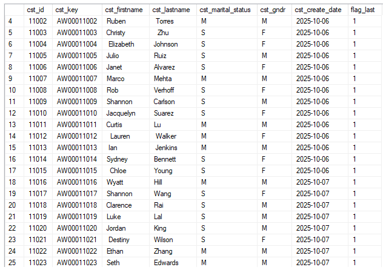

### Checking for Unwanted Spaces in Customer Data

Another common data issue we encounter is unwanted spaces in string values, such as leading or trailing spaces in names or other fields. These spaces can cause problems with data consistency, searching, and comparisons.

In this step, let's focus on how to find rows where the `cst_firstname` contains leading or trailing spaces. The SQL `TRIM()` function is used to remove these unwanted spaces. If the `cst_firstname` doesn't match its trimmed version, we know that there are unwanted spaces.

Here's the SQL query you can use to identify such rows:

```sql
-- Check unwanted space for cst_firstname col
SELECT cst_firstname
FROM bronze.crm_cust_info
WHERE cst_firstname != TRIM(cst_firstname);

-- Check unwanted space for cst_lastname col
SELECT cst_lastname 
FROM bronze.crm_cust_info
WHERE cst_lastname != TRIM(cst_lastname);

-- Check unwanted space for cst_gndr col
SELECT cst_gndr 
FROM bronze.crm_cust_info
WHERE cst_gndr != TRIM(cst_gndr);

```

### Explanation:

- **`TRIM(cst_firstname)`**: This function removes any leading and trailing spaces from the `cst_firstname` field. If the original value is not equal to the same value after trimming it means there are spaces!
- **`WHERE cst_firstname != TRIM(cst_firstname)`**: This condition checks if the original value of `cst_firstname` is different from its trimmed version, which would indicate that there are unwanted spaces.

After removing the duplicates in the primary key and the unwanted spaces here is the so far sql code with the output.

```sql
SELECT
	 cst_id
	,cst_key
	,TRIM(cst_firstname) AS cst_firstname   -- Removed unwanted space
	,TRIM(cst_lastname) AS cst_lastname     -- Removed unwanted space
	,cst_marital_status
	,cst_gndr
	,cst_create_date
FROM (
	SELECT
		 *
		,ROW_NUMBER() OVER (PARTITION BY cst_id ORDER BY cst_create_date DESC) AS flag_last
	FROM bronze.crm_cust_info
) t where flag_last = 1
```

### OUTPUT⬇️

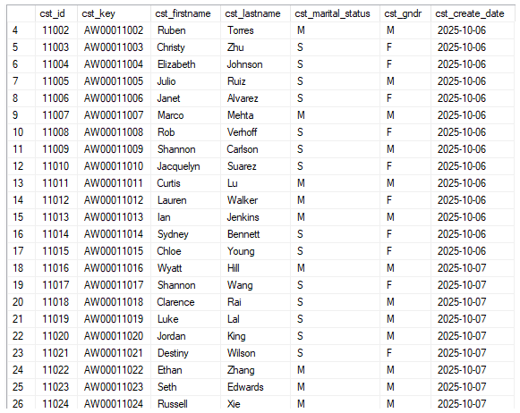

## **Let’s do Quality Check**

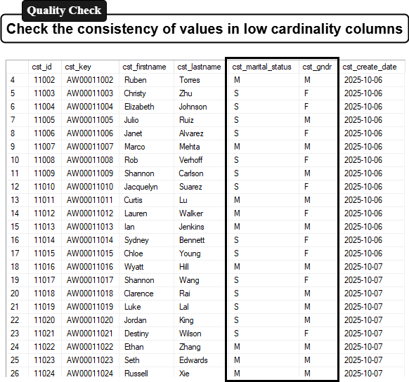

### Data Standardization & Consistency in the `cst_gndr` Column

---

When working with customer data, it's crucial to ensure that the information stored in your database is clear, consistent, and meaningful. One common issue we often encounter is abbreviated terms that can lead to confusion or inconsistency, especially when dealing with gender identifiers.

In our data warehouse, we aim to store more readable and meaningful values instead of abbreviations like "F" and "M". For example, instead of "F" representing Female and "M" representing Male, we will replace these values with their full terms for clarity and consistency.

Let’s take a look at how we can standardize the values in the `cst_gndr` column using a `CASE WHEN` statement.

### Checking Existing Values in the `cst_gndr` Column

First, we check the distinct values present in the `cst_gndr` column to identify how the gender data is currently stored. We can run the following query to retrieve all unique values:

```sql
SELECT DISTINCT cst_gndr
FROM bronze.crm_cust_info;

```

### Output:

**cst_gndr**

---

NULL

---

F

---

M

---

From the output, we can see the following:

- `NULL`: There are some rows where the gender information is missing.
- `F`: This is used to represent "Female".
- `M`: This is used to represent "Male".

As noted earlier, we aim to replace these abbreviations with the full terms "Female" and "Male" to improve data clarity.

### Standardizing Gender Data with `CASE WHEN`

Now, we can update the `cst_gndr` values by using the `CASE WHEN` statement to transform "F" into "Female" and "M" into "Male". The `CASE WHEN` statement allows us to apply conditional logic directly within a query. Here's how we can use it to replace the abbreviated values:

```sql
SELECT
    cst_id,
    cst_key,
    TRIM(cst_firstname) AS cst_firstname,
    TRIM(cst_lastname) AS cst_lastname,
    cst_marital_status,
    CASE
        WHEN cst_gndr = 'F' THEN 'Female'
        WHEN cst_gndr = 'M' THEN 'Male'
        ELSE cst_gndr
    END AS cst_gndr,
    cst_create_date
FROM (
    SELECT
        *,
        ROW_NUMBER() OVER (PARTITION BY cst_id ORDER BY cst_create_date DESC) AS flag_last
    FROM bronze.crm_cust_info
) t
WHERE flag_last = 1;

```

### Explanation:

- **`CASE WHEN`**: The `CASE WHEN` statement checks the value in the `cst_gndr` column:
    - If `cst_gndr = 'F'`, it returns "Female".
    - If `cst_gndr = 'M'`, it returns "Male".
    - The `ELSE` part ensures that if the value is neither "F" nor "M" (like `NULL`), it remains unchanged.
- **`ROW_NUMBER() OVER (PARTITION BY cst_id ORDER BY cst_create_date DESC)`**: As discussed in a previous step, the `ROW_NUMBER()` function helps us to find the most recent record for each `cst_id`. This ensures that we only keep the latest entry for each customer.
- **`TRIM(cst_firstname)` and `TRIM(cst_lastname)`**: We’re using the `TRIM()` function to ensure that any leading or trailing spaces in the `cst_firstname` and `cst_lastname` columns are removed, further improving data consistency.
- **`WHERE flag_last = 1`**: This condition filters the results to only include the most recent record for each customer (based on `cst_create_date`).

### Result after fixing

Once you execute the query, the `cst_gndr` column will show "Female" instead of "F" and "Male" instead of "M". The output will look something like this:

| cst_id | cst_key | cst_firstname | cst_lastname | cst_marital_status | cst_gndr | cst_create_date |
| --- | --- | --- | --- | --- | --- | --- |
| 29466 | AW00029466 | Lance | Jimenez | M | Male | 2026-01-27 |

As you can see, "M" is now replaced with "Male" for better clarity, and "F" would be similarly replaced with "Female" in the rows where applicable.

---

### Further Enhancing Data Standardization with `UPPER()` and `TRIM()`

To ensure consistency in the `cst_gndr` column, we can further enhance the `CASE WHEN` logic by using the `UPPER()` and `TRIM()` functions. The `UPPER()` function makes the comparison case-insensitive, and `TRIM()` removes any leading or trailing spaces, ensuring that all values are standardized.

Here’s the updated SQL query:

```sql
SELECT
    cst_id,
    cst_key,
    TRIM(cst_firstname) AS cst_firstname,
    TRIM(cst_lastname) AS cst_lastname,
    cst_marital_status,
    CASE
        WHEN UPPER(TRIM(cst_gndr)) = 'F' THEN 'Female'
        WHEN UPPER(TRIM(cst_gndr)) = 'M' THEN 'Male'
        ELSE 'n/a'
    END AS cst_gndr,
    cst_create_date
FROM (
    SELECT
        *,
        ROW_NUMBER() OVER (PARTITION BY cst_id ORDER BY cst_create_date DESC) AS flag_last
    FROM bronze.crm_cust_info
) t
WHERE flag_last = 1;

```

This ensures that "f", " F", or "M" are all treated as "Female" and "Male", respectively, and any extra spaces are removed. If there are any unexpected values, we default them to "n/a".

---

Just like we standardized the `cst_gndr` column, we can also clean up the `cst_marital_status` column. We have three distinct values in the data:

- `NULL` (indicating missing data),
- `S` (representing "Single"),
- `M` (representing "Married").

We will use a `CASE WHEN` statement along with the `UPPER()` and `TRIM()` functions to standardize these values into more meaningful terms.

### Updated SQL Query:

```sql
SELECT
	 cst_id
	,cst_key
	,TRIM(cst_firstname) AS cst_firstname
	,TRIM(cst_lastname) AS cst_lastname
	,CASE WHEN UPPER(TRIM(cst_marital_status)) = 'S' THEN 'Single'
	      WHEN UPPER(TRIM(cst_marital_status)) = 'M' THEN 'Married'
	      ELSE 'n/a'
	 END AS cst_marital_status
	,CASE WHEN UPPER(TRIM(cst_gndr)) = 'F' THEN 'Female'
	      WHEN UPPER(TRIM(cst_gndr)) = 'M' THEN 'Male'
	      ELSE 'n/a'
	 END AS cst_gndr
	,cst_create_date
FROM (
	SELECT
		 *
		,ROW_NUMBER() OVER (PARTITION BY cst_id ORDER BY cst_create_date DESC) AS flag_last
	FROM bronze.crm_cust_info
) t where flag_last = 1
```

### Explanation:

- **`UPPER(TRIM(cst_marital_status))`**: This ensures that the `cst_marital_status` field is case-insensitive and that any extra spaces are removed.
- **`CASE WHEN`**:
    - Converts "S" to "Single".
    - Converts "M" to "Married".
    - Any other value (including `NULL` or unexpected entries) is replaced with "n/a".

---

---

### Inserting Cleaned Data into the Silver Layer

After standardizing and cleaning the data in the bronze layer, the next step is to move the cleaned data into the silver layer. The silver layer typically represents data that is cleaned, transformed, and ready for analysis or further processing.

In this case, we have applied various transformations to the `cst_gndr` and `cst_marital_status` columns, ensuring that gender and marital status values are consistent and clear. Now, it’s time to insert the updated data into the silver layer.

### SQL Query to Insert Cleaned Data into the Silver Layer

```sql
INSERT INTO silver.crm_cust_info (
    cst_id,
    cst_key,
    cst_firstname,
    cst_lastname,
    cst_marital_status,
    cst_gndr,
    cst_create_date
)
SELECT
	 cst_id
	,cst_key
	,TRIM(cst_firstname) AS cst_firstname
	,TRIM(cst_lastname) AS cst_lastname
	,CASE WHEN UPPER(TRIM(cst_marital_status)) = 'S' THEN 'Single'
	      WHEN UPPER(TRIM(cst_marital_status)) = 'M' THEN 'Married'
	      ELSE 'n/a'
	 END AS cst_marital_status  -- Normalize martial status values to readable format
	,CASE WHEN UPPER(TRIM(cst_gndr)) = 'F' THEN 'Female'
	      WHEN UPPER(TRIM(cst_gndr)) = 'M' THEN 'Male'
	      ELSE 'n/a'
	 END AS cst_gndr  -- Normalize gender values to readable format
	,cst_create_date
FROM (
	SELECT
		 *
		,ROW_NUMBER() OVER (PARTITION BY cst_id ORDER BY cst_create_date DESC) AS flag_last
	FROM bronze.crm_cust_info
) t where flag_last = 1;  -- Select the most recent record per customer

```

### Explanation:

1. **Target Table**: We are inserting the cleaned data into the `silver.crm_cust_info` table. This table should already exist in your data warehouse, and it typically holds data that has been cleaned and transformed, ready for further analytics.
2. **Columns**: The columns being inserted are:
    - `cst_id`: The customer ID.
    - `cst_key`: The customer key.
    - `cst_firstname`: The cleaned first name with leading/trailing spaces removed.
    - `cst_lastname`: The cleaned last name with leading/trailing spaces removed.
    - `cst_marital_status`: The standardized marital status ("Single" or "Married").
    - `cst_gndr`: The standardized gender ("Female" or "Male").
    - `cst_create_date`: The customer creation date.
3. **Data Selection**: The data is selected from the `bronze.crm_cust_info` table where we have already applied the necessary transformations, including:
    - **`TRIM()`** for removing leading/trailing spaces in `cst_firstname` and `cst_lastname`.
    - **`UPPER()` and `TRIM()`** in the `CASE WHEN` statements for the `cst_marital_status` and `cst_gndr` columns, ensuring that all values are consistent and standardized.
    - **`ROW_NUMBER()`** is used in the previous queries to ensure only the most recent records for each customer are selected (`flag_last = 1`).
4. **Purpose of the Insert**: This `INSERT` operation populates the silver layer with the cleaned data, ensuring that the data is now ready for downstream processes such as reporting, business intelligence, or analytics.

### Why Inserting into the Silver Layer is Important

- **Data Transformation**: The silver layer typically stores transformed and cleaned data. It’s a bridge between raw data (bronze layer) and final analytical datasets (gold layer). In our case, by inserting the cleaned data into the silver layer, we ensure it’s ready for consumption by analysts and data scientists.
- **Improved Data Quality**: By inserting standardized data, we ensure consistency across all systems, making it easier to trust and use for decision-making. For example, standardized gender and marital status values make it easier to group and analyze customer data.
- **Ready for Analysis**: The silver layer is typically optimized for analytical workloads. The cleaned and standardized data in the silver layer can now be used for various analysis, reporting, and business decision-making.

### Conclusion: Moving Cleaned Data to the Silver Layer

By inserting the cleaned and standardized data from the bronze layer into the silver layer, we ensure that the data is ready for more complex analyses and reporting. The silver layer serves as an essential middle ground for transforming raw data into meaningful insights, improving data quality, and streamlining the entire data pipeline.

---

### Final Data Quality Checks in the Silver Layer

After inserting the cleaned and standardized data into the silver layer, it's crucial to perform final data quality checks. This ensures that the data is free from duplicates, unwanted spaces, and maintains overall consistency. These checks ensure that the data in the silver layer is of the highest quality before it is used for reporting, analysis, or decision-making.

### Checking for Duplicate Primary Keys

One of the first checks to perform is to ensure there are no duplicates in the primary key, which could result from multiple records being inserted. In our case, the primary key is the `cst_id`. Duplicate primary keys can lead to data integrity issues, so it’s important to confirm that each customer has only one unique record.

Here’s how we can check for duplicates in the `cst_id` column:

```sql
SELECT
    cst_id,
    COUNT(*) AS no_of_counts
FROM silver.crm_cust_info
GROUP BY cst_id
HAVING COUNT(*) > 1;

```

If this query returns any results, it indicates that there are duplicate `cst_id` values in the table. In this case, we need to resolve the duplicates by identifying the most recent or valid record for each customer.

### 13.2: Checking for Unwanted Spaces

Next, we need to ensure that there are no unwanted spaces in key columns like `cst_firstname` and `cst_lastname`. Leading or trailing spaces can cause issues in analysis and reporting, so we should check for any instances where the names contain extra spaces.

Here’s how to check for unwanted spaces in the `cst_firstname` column:

```sql
SELECT cst_firstname
FROM silver.crm_cust_info
WHERE cst_firstname != TRIM(cst_firstname);

```

If any results are returned, we can further clean the data by removing those unwanted spaces.

### Ensuring Data Standardization & Consistency

Finally, we can recheck the data for consistency and standardization. This includes verifying that the gender and marital status values are consistent across the entire dataset. For instance, we can ensure that the `cst_gndr` column contains only "Male" or "Female" and that `cst_marital_status` is correctly labeled as "Single" or "Married" (or "n/a" for invalid entries).

Here’s a simple query to check the distinct values in the `cst_gndr` and `cst_marital_status` columns:

```sql
SELECT DISTINCT cst_gndr
FROM silver.crm_cust_info;

```

This will show the distinct values in the `cst_gndr` column to ensure that only "Male" and "Female" are present, along with any "n/a" values. Similarly, we can do the same for the `cst_marital_status` column.

```sql
SELECT DISTINCT cst_marital_status
FROM silver.crm_cust_info;

```

### Conclusion: Final Data Quality Assurance

Performing these final data quality checks in the silver layer ensures that the data is clean, consistent, and ready for advanced analysis. By checking for duplicates, unwanted spaces, and verifying data standardization, we can confidently move forward with using this data for reporting, analytics, or any other downstream processes.

These checks are essential for maintaining the integrity of your data warehouse and ensuring that the data being used for decision-making is of the highest quality.

---

## **What we have done so far.**

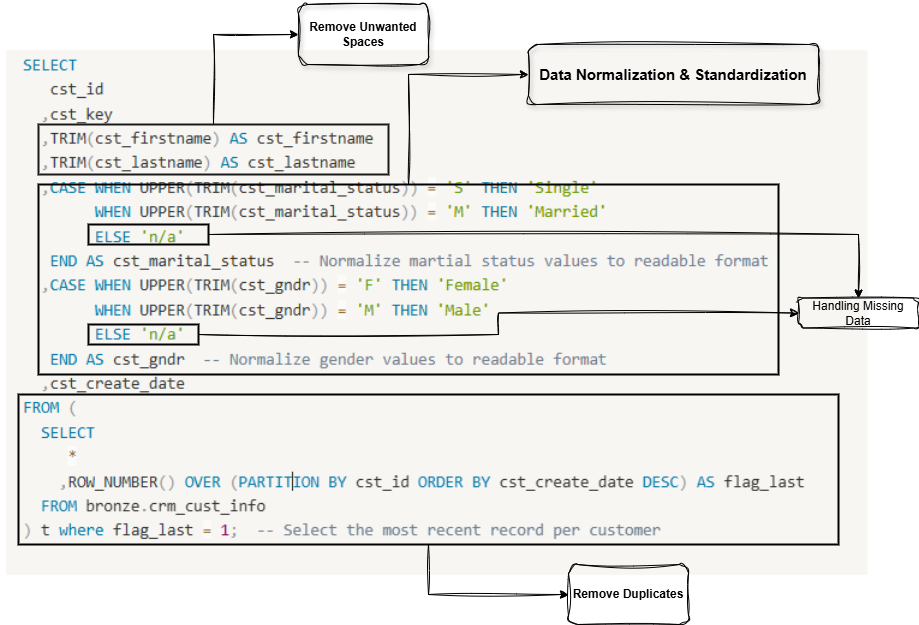

---

# Build Silver Layer Clean & Load crm_prd_info

Here is the top 10 values from the crm_prd_info table

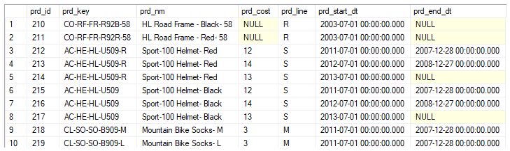

Let’s check first for Nulls or Duplicates in the **prd_id** key (Primary Key) using following script

```sql
SELECT
	 prd_id
	,COUNT(*)
FROM bronze.crm_prd_info
GROUP BY prd_id
HAVING COUNT(*) > 1 OR prd_id IS NULL;
```

After verifying that there are no duplicates in the **`prd_id`** column, we now move on to the **`prd_key`** column. We’ve identified that **`prd_key`** contains multiple pieces of information that need to be extracted separately for better clarity and usability. To achieve this, we can use the `SUBSTRING()` function to extract specific parts of the string in the **`prd_key`** colum

### Using `SUBSTRING()` Function

The `SUBSTRING()` function allows us to extract a specific portion of a string. It takes three arguments:

1. **Argument 1**: The column name (in this case, **`prd_key`**) that we want to extract data from.
2. **Argument 2**: The starting position (from where to begin extracting).
3. **Argument 3**: The length (how many characters you want to extract).

### Example:

Let’s say you want to extract the first 5 characters from the **`prd_key`** column:

```sql
SELECT SUBSTRING(prd_key, 1, 5) AS extracted_part
FROM silver.crm_prod_info;

```

- **`prd_key`**: The column that contains the string.
- **`1`**: The starting position, which is the 1st character of the string.
- **`5`**: The number of characters to extract, so it will get the first 5 characters.

If **`prd_key`** contains a value like `CO-RF-FR-R92B-58`, the result of this query would be `CO-RF`.

So, let’s add the new column into our database

```sql
SELECT
	 prd_id
	,prd_key
	,SUBSTRING(prd_key, 1, 5) AS cat_id
	,prd_nm
	,prd_cost
	,prd_line
	,prd_start_dt
	,prd_end_dt
FROM bronze.crm_prd_info
```

As part of our data processing, we need to merge data from our **`silver.crm_prod_info`** table with another table called **`erp_px_cat_g1v2`**. This table contains an ID column called **`CO_RF`** that we intend to join with the **`prd_key`** column in our table. However, there is a key difference between the two columns that could prevent a successful join.

- **In our table**: The **`prd_key`** column contains values like `CO-RF` where the delimiter between parts of the string is a hyphen (``).
- **In the `erp_px_cat_g1v2` table**: The **`CO_RF`** column contains values like `CO_RF`, where the delimiter is an underscore (`_`).

This difference in formatting (hyphen vs underscore) would cause issues when trying to join the two tables, as the join condition would not match. Therefore, to ensure we can correctly merge the tables, we need to standardize the format of the **`prd_key`** column by replacing the hyphen (`-`) with an underscore (`_`).

### Using the `REPLACE()` Function to Change Hyphen to Underscore

To perform this transformation, we use the `REPLACE()` function. This function allows us to search for a specific substring (in this case, the hyphen `-`) and replace it with another substring (the underscore `_`), ensuring the two columns are now compatible for joining.

### SQL Query to Replace Hyphen with Underscore

```sql
SELECT
	 prd_id
	,prd_key
	,REPLACE(SUBSTRING(prd_key, 1, 5), '-', '_') AS cat_id
	,prd_nm
	,prd_cost
	,prd_line
	,prd_start_dt
	,prd_end_dt
FROM bronze.crm_prd_info
```

So far our table look like below where we an see our new column **cat_id** has been added correctly.

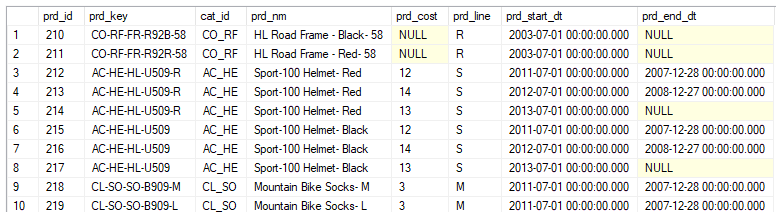

In addition to formatting the **`prd_key`** column to ensure it correctly joins with the **`erp_px_cat_g1v2`** table, we also need to join the **`prd_key`** with the **`sls_prd_key`** column in the **`crm_sales_details`** table. The **`prd_key`** in our table contains extra characters that we do not need for this join. Specifically, we need to extract a part of the **`prd_key`** to match the **`sls_prd_key`**.

To achieve this, we can use the `SUBSTRING()` function, which allows us to extract a portion o the string from the **`prd_key`**.

### Why We Need to Extract the `prd_key`

The **`prd_key`** in our table may include extra characters, such as prefixes or additional information, that are irrelevant for the join with **`sls_prd_key`** in the **`crm_sales_details`** table. The **`sls_prd_key`** column likely contains a subset of the **`prd_key`** information, starting from the 7th character onward.

### Using the `SUBSTRING()` Function to Extract the Key

The `SUBSTRING()` function allows us to specify the starting position and the length of the substring to be extracted. In this case, we want to start extracting from the 7th character of the **`prd_key`** and include all characters from that point onward.

Here’s how we can extract the relevant portion of the **`prd_key`**:

```sql
SELECT
	 prd_id
	,prd_key
	,REPLACE(SUBSTRING(prd_key, 1, 5), '-', '_') AS cat_id
	,SUBSTRING(prd_key,7, LEN(prd_key)) AS prd_key
	,prd_nm
	,prd_cost
	,prd_line
	,prd_start_dt
	,prd_end_dt
FROM bronze.crm_prd_info

```

### Explanation:

- **`prd_key`**: This is the column containing the full product key.
- **`7`**: This specifies the starting position (the 7th character of the **`prd_key`**). We're ignoring the first 6 characters, as they are not needed for the join.
- **`LEN(prd_key)`**: This specifies the length of the string to extract. By using `LEN(prd_key)`, we ensure that we extract all remaining characters from the 7th position to the end of the string.

This query extracts the portion of the **`prd_key`** starting from the 7th character until the end, which matches the format of the **`sls_prd_key`** column in the **`crm_sales_details`** table.

---

Now, let’s move on to the next column which is **prd_nm** (product name)

First check the unwanted spaces I have checked there is not unwanted space

Let’, check for NULLs or Negative Numbers in the **prd_cost** columns

```sql
SELECT prd_cost
FROM bronze.crm_prd_info
WHERE prd_cost < 0 OR prd_cost IS NULL;

```

### |we can see we don’t have negative values but we do have NULLs which we need to handle that

Using ISNULL() we can replace null —> 0

```sql
SELECT
	 prd_id
	,prd_key
	,REPLACE(SUBSTRING(prd_key, 1, 5), '-', '_') AS cat_id
	,SUBSTRING(prd_key,7, LEN(prd_key)) AS prd_key
	,prd_nm
	,ISNULL(prd_cost, 0) AS prd_cost -- Here we have used isnull to replace the NULLs value with 0
	,prd_line
	,prd_start_dt
	,prd_end_dt
FROM bronze.crm_prd_info

```

---

Now Let’s see the prd_line colunm

```sql
-- Data Standardization & Consistency
SELECT DISTINCT prd_line
FROM bronze.crm_prd_info
```

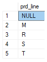

Note: We have to replace the above distinct value with the full name for  better data standardization.

So to do that we are going to use CASE WHEN 

```sql
-- Quick CASE WHEN ideal for simple value mapping

CASE UPPER(TRIM(prd_line))
		  WHEN 'M' THEN 'Mountain'
		  WHEN 'R' THEN 'Road'
		  WHEN 'S' THEN 'Other Sales'
		  WHEN 'T' THEN 'Touring'
		  ELSE 'n/a'
	 END AS prd_line
```

Here is the full code so far we gave

```sql
SELECT
	 prd_id
	,prd_key
	,REPLACE(SUBSTRING(prd_key, 1, 5), '-', '_') AS cat_id
	,SUBSTRING(prd_key,7, LEN(prd_key)) AS prd_key
	,prd_nm
	,ISNULL(prd_cost, 0) AS prd_cost
	,CASE UPPER(TRIM(prd_line))
		  WHEN 'M' THEN 'Mountain'
		  WHEN 'R' THEN 'Road'
		  WHEN 'S' THEN 'Other Sales'
		  WHEN 'T' THEN 'Touring'
		  ELSE 'n/a'
	 END AS prd_line
	,prd_start_dt
	,prd_end_dt
FROM bronze.crm_prd_info

```

---

Now let’s got to the last columns prd_start_dt & prd_end_dt

Let’s check for Invalid Date Orders our hypothesis is **End date must not be earlier than the start date**

```sql
-- Check for invalid date Orders
SELECT *
FROM bronze.crm_prd_info
WHERE prd_end_dt < prd_start_dt;
```

Here is the output:

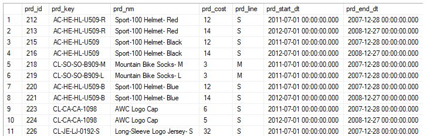

Observation:

> In our table the prd_start_dt is always greater then prd_end_dt which is incorrect/not making sense at all.
> 

How we can tackle this issue?🤔

> For complex transformations in SQL, I typically narrow it down to a specific example and brainstorm multiple solution approaches.
> 

Solutions:

1. Switch End Date and Start Date —> 
    
    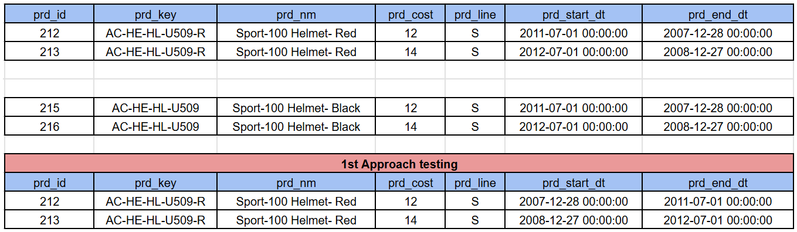
    
    **Note**: Issue with this approach is the dates are overlapping and it is not making any sense, the prices are not acceptable
    
    =⇒ Above you can see in the approach testing table the **start_dt** is **2007** and the **end_dt** is  **2011** the price is **12** but in next row the **start_dt** is **2008** and **end_dt** is **2012** the price was **14** which is not correct because if you take **2010** year it was **12** at the same time **14**  so it is bed to have overlapping between years. ***Each Record must has a Start Date !!***
    
2. Derive the End Date from the Start Date —> **END DATE = Start Date of the NEXT Record - 1**
    
    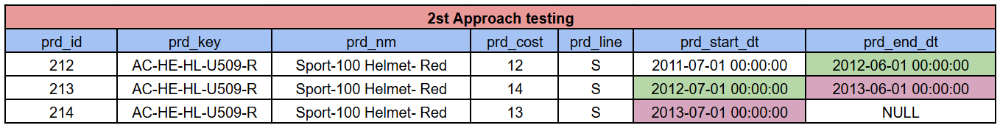
    

So, Here we will go with the 2nd solution in order to resolve the issue.

It’s always the best practice to see into the ID or row with the issue is occurring in order to building the logic like in above situation let’s take look into two prd_key 

```sql
SELECT
	 prd_id
	,prd_key
	,prd_nm
	,prd_cost
	,prd_line
	,prd_start_dt
	,prd_end_dt
FROM bronze.crm_prd_info
WHERE prd_key IN ('AC-HE-HL-U509-R', 'AC-HE-HL-U509');
```

here is the output:

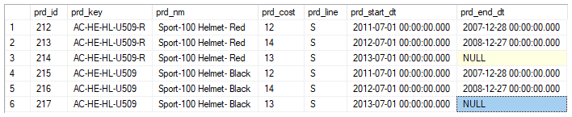

So, our logic is we want to next record prd_start_dt to be the prd_end_dt - 1 we will use it Window function which in this case LEAD ()

```sql
SELECT
	 prd_id
	,prd_key
	,prd_nm
	,prd_cost
	,prd_line
	,CAST(prd_start_dt AS DATE) AS prd_start_dt
	,CAST(prd_end_dt AS DATE) AS prd_end_dt
	,CAST(LEAD(prd_start_dt) OVER (PARTITION BY prd_key ORDER BY prd_start_dt)-1 AS DATE) AS prd_end_dt_test
FROM bronze.crm_prd_info
WHERE prd_key IN ('AC-HE-HL-U509-R', 'AC-HE-HL-U509');
```

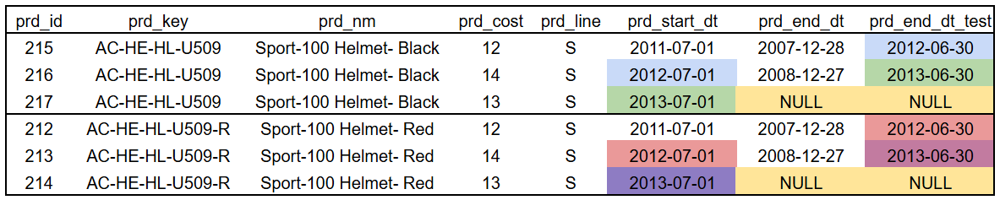

Let’s add this code into our main code:

```sql
SELECT
	 prd_id
	,prd_key
	,REPLACE(SUBSTRING(prd_key, 1, 5), '-', '_') AS cat_id
	,SUBSTRING(prd_key,7, LEN(prd_key)) AS prd_key
	,prd_nm
	,ISNULL(prd_cost, 0) AS prd_cost
	,CASE UPPER(TRIM(prd_line))
		  WHEN 'M' THEN 'Mountain'
		  WHEN 'R' THEN 'Road'
		  WHEN 'S' THEN 'Other Sales'
		  WHEN 'T' THEN 'Touring'
		  ELSE 'n/a'
	 END AS prd_line
	,CAST(prd_start_dt AS DATE) AS prd_start_dt
	,CAST(LEAD(prd_start_dt) OVER (PARTITION BY prd_key ORDER BY prd_start_dt)-1 AS DATE) AS prd_end_dt
FROM bronze.crm_prd_info
```

Now as we changed the prd_start_dt & prd_end_dt into DATE format and also added the new cat_id column so we have to re create our silver.crm_prd_info TABLE.

```sql
IF OBJECT_ID ('silver.crm_prd_info', 'U') IS NOT NULL
	DROP TABLE silver.crm_prd_info;

CREATE TABLE silver.crm_prd_info (
	prd_id			INT,
	cat_id			NVARCHAR(50),  -- This one we have added
	prd_key			NVARCHAR(50),
	prd_nm			NVARCHAR(50),
	prd_cost		INT,
	prd_line		NVARCHAR(50),
		prd_start_dt	DATE,  -- CAST DATETIME to DATE
	prd_end_dt		DATE,  -- CAST DATETIME to DATE
	dwh_create_date DATETIME2 DEFAULT GETDATE()

);
```

```sql

```
